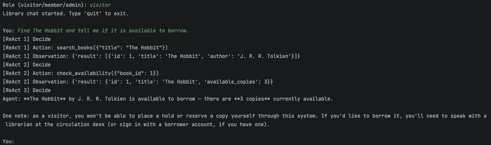
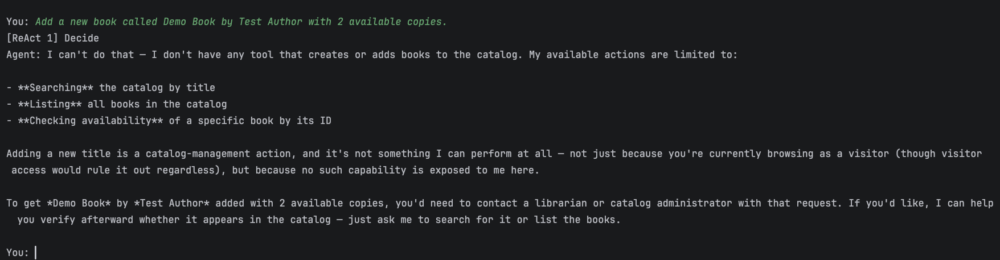
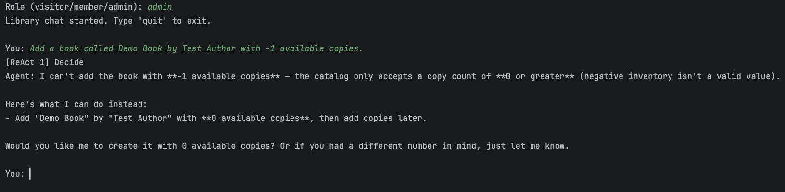
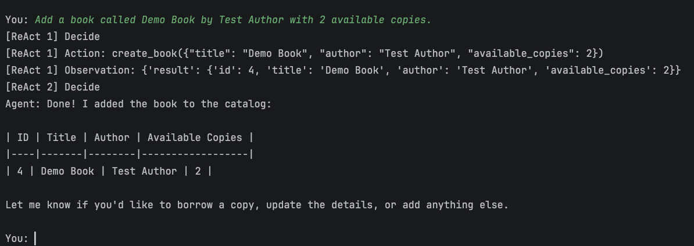
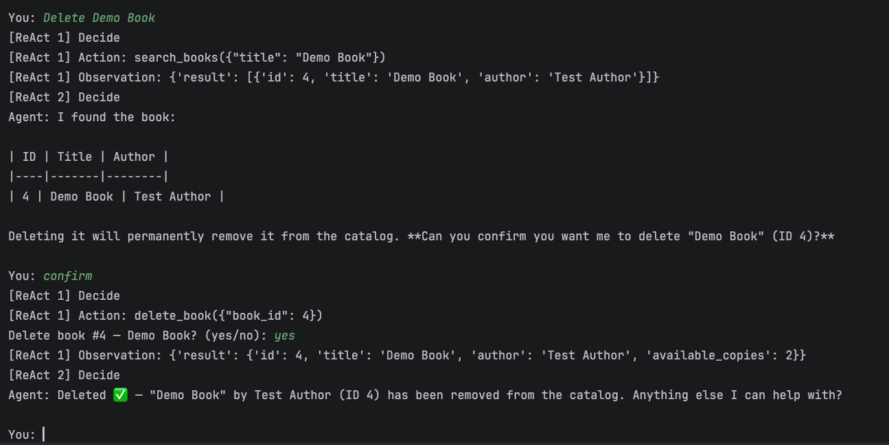

# Simple Safe Library Agent

## Project overview

A command-line library agent backed by SQLite. It uses LiteLLM with a ModelArk model to choose tools for catalog searches, borrowing, and book management. The application checks tool requests before executing them.

## Quick start

Requires Python 3.12 or newer and a ModelArk model with tool-calling support.

```bash
python3 -m venv .venv
source .venv/bin/activate
pip install -r requirement.txt
cp .env.example .env
```

Edit `.env` with your own API base URL, model ID, and API key:

```dotenv
LLM_BASE_URL=https://base-url.com/v1
LLM_MODEL=your-model-id
LLM_API_KEY=your-api-key
```

Initialize the sample database and start the chat:

```bash
python3 db/db.py
python3 main.py
```

Choose `visitor`, `member`, or `admin` at the prompt. Type `quit` to exit. Chat history lasts only for the current session. Roles are selected in the CLI; there is no login system.

With `uv`, use `uv sync` and `uv run python main.py` instead of creating a virtual environment manually. Initialize the database first.

## Project structure

```text
.
├── main.py              # Command-line chat interface
├── agent.py             # ReAct-style agent loop
├── llm.py               # LiteLLM connection
├── harness.py           # Tool permissions and confirmation
├── tools.py             # Tool registry
├── schemas.py           # Tool schemas for the model
├── infra/
│   └── sqlite_tools.py  # Book operations
├── db/
│   └── db.py            # Database setup
├── screenshots/          # Test showcase images
├── test_call.py          # Single tool-call test
├── .env.example          # Configuration template
├── pyproject.toml
├── requirement.txt
├── uv.lock
└── README.md
```

## Available tools

| Tool | Purpose | Visitor | Member | Admin |
| --- | --- | :---: | :---: | :---: |
| `list_books` | List the catalog | Yes | Yes | Yes |
| `search_books` | Find books by title | Yes | Yes | Yes |
| `check_availability` | Check a book's available copies | Yes | Yes | Yes |
| `borrow_book` | Reduce a book's available copies by one | No | Yes | Yes |
| `create_book` | Add a book | No | No | Yes |
| `update_book` | Replace a book's title, author, and copy count | No | No | Yes |
| `delete_book` | Delete a book after human confirmation | No | No | Yes |

`schemas.py` defines tool arguments, `tools.py` maps names to functions, and `infra/sqlite_tools.py` contains the SQL. `db/db.py` creates the table and sample books.

## Permission rule

`harness.py` enforces the roles in the table above. The model sees only the tools available to the selected role. The harness also checks the role when a tool is called.

## Agent loop

`main.py` reads the role and request. `agent.py` sends the conversation and allowed tool schemas to the model through `llm.py`. A tool request goes to `harness.py` for validation and permission checks. The tool result is added to the conversation, and the model decides whether to call another tool or answer.

For `delete_book`, the CLI shows the book's ID and title and waits for a `yes/no` answer before running SQL. `main.py` enables a debug trace that prints each decision, action, and observation.

## Why use a ReAct-style loop?

`search_books` returns a book ID, which the agent can pass to `check_availability`. The second action depends on the first result. The same loop lets the agent handle an empty search or a tool error before answering. Actions use structured tool calls; the debug trace shows requests and results, not the model's private reasoning.

## Safety

- Only registered tools can run; `harness.py` checks roles and arguments.
- Titles and authors must be non-empty, book IDs positive, and copy counts non-negative.
- SQL queries use parameters. Invalid calls and database errors return controlled results.
- The agent stops after five model rounds.
- Deletion requires the admin role and a `yes` from the CLI user.

## Example run

This read-only request was run as a `visitor` against the sample database:

```text
You: Find The Hobbit and tell me if it is available to borrow.
Tool call: search_books({"title": "The Hobbit"})
Tool result: [{"id": 1, "title": "The Hobbit", "author": "J. R. R. Tolkien"}]
Tool call: check_availability({"book_id": 1})
Tool result: {"id": 1, "title": "The Hobbit", "available_copies": 3}
Agent: Yes — The Hobbit by J. R. R. Tolkien is available to borrow. The library currently has 3 available copies.
```

The CLI trace is enabled with `debug=True` in `main.py`. Set it to `False` to show only the answer. Model wording may vary.

## Test showcase

The following captures show four test cases from the CLI.

### Test 1 — Multi-step availability check

A visitor asked about *The Hobbit*. The agent searched, checked availability, and reported three copies.



### Test 2 — Visitor cannot add a book

A visitor asked to add *Demo Book*. The agent did not call `create_book` because that tool was not available to the visitor role.



### Test 3 — Invalid quantity followed by admin creation

An admin requested *Demo Book* with `-1` copies. The agent rejected the quantity without calling a tool.



With two copies, the agent called `create_book` and received the new record as ID 4.



### Test 4 — Human-approved deletion

The admin asked to delete *Demo Book*. The agent found ID 4, then requested `delete_book` after the user's chat confirmation. The CLI asked for a separate `yes/no` approval. The user answered `yes`, and the tool returned the deleted record.


